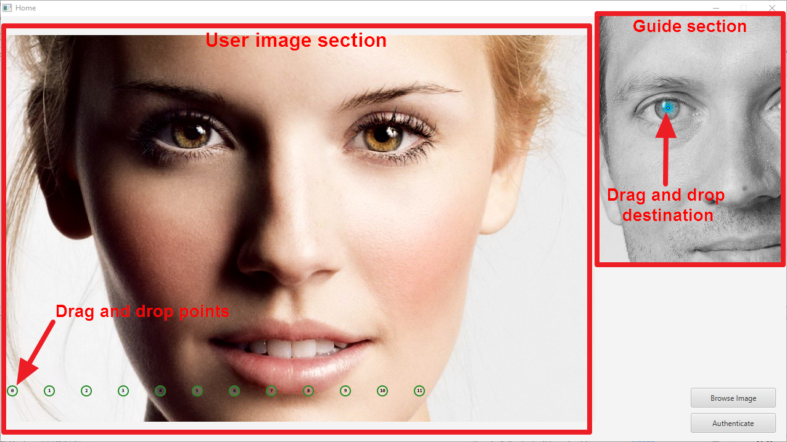
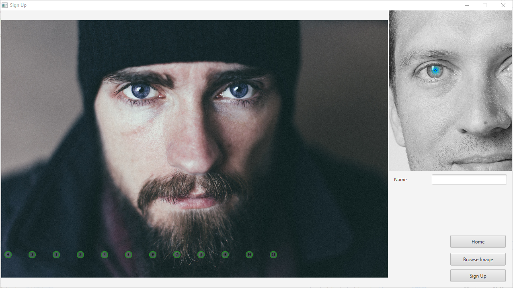

Face Biometric Authentication System - Manual
=============================================

This is an assignment project for Computer Security (CS3052 Assignment 1) 

##Table of Contents

- [Install](#Install)
- [Usage](#Usage)
	- [Log In](#log-in)
	- [Sign Up](#sign-up)


##Install

```shell
$ cd src
$ javac biometricauthenticationscheme/*.java
```

##Usage

```shell
$ java biometricauthenticationscheme.BiometricAuthenticationScheme
```

###Sections

####Log In



Drag and drop the 12 markers as the guide provided in the guide section.
Then click authenticate button to authenticate the given points.
If authenticated, The **Sign Up** button will appear. 

###Sign Up



The sections are same as log in. Drag and drop the markers with name as the guide provided and sign up.
